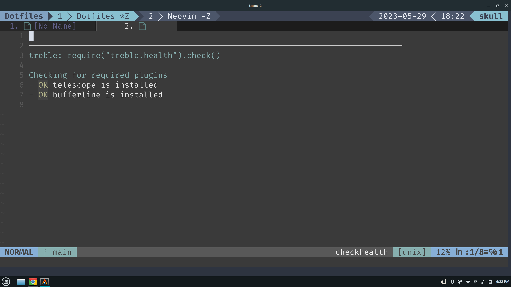

# treble.nvim

According to Merrian-Webster, one
[definition](https://www.merriam-webster.com/dictionary/treble) that the word
`treble` can take on is "having three parts or uses." With `treble.nvim`, the
three parts are
1. Neovim Buffers
1. [bufferline.nvim](https://github.com/akinsho/bufferline.nvim) Plugin
1. [telescope.nvim](https://github.com/nvim-telescope/telescope.nvim) Plugin

## What is Treble?

`treble.nvim` is a Neovim plugin which builds a custom `telescope.nvim` picker
populated by data directly from `bufferline.nvim`. Numbering of buffers within
the custom picker are intended to match the relative numbering of buffers within
the bufferline instead of using the unique `bufnr` from Neovim.

## Installation

The `treble.nvim` plugin is intended for use by folks already using both
`bufferline.nvim` and `telescope.nvim` as plugins.

```Lua
-- using lazy.nvim
{
  'ryanoneill/treble.nvim',
  dependencies = {
    {
      'akinsho/bufferline.nvim',
      version = '*',
      dependencies = 'nvim-tree/nvim-web-devicons'
    },
    {
      'nvim-telescope/telescope.nvim',
      tag = '0.1.1',
      dependencies = 'nvim-lua/plenary.nvim'
    }
  }
}
```

```Lua
-- using packer.nvim
use {
  'ryanoneill/treble.nvim',
  requires = {
    {
      'akinsho/bufferline.nvim',
      version = '*',
      requires = { 'nvim-tree/nvim-web-devicons' }
    },
    {
      'nvim-telescope/telescope.nvim',
      tag = '0.1.1',
      requires = { 'nvim-lua/plenary.nvim' }
    }
  }
}
```

### Verifying Installation

To verify that `treble.nvim` and its required dependencies, `bufferline.nvim`
and `telescope.nvim` are installed correctly, run the *checkhealth* command:

```viml
:checkhealth treble
```

If all is good, the *checkhealth* command for `treble.nvim` will run, and an
`OK` will be displayed for both required dependencies as in the following screenshot.



## Usage

`treble.buffers()` is intended as a drop-in replacement for where
`builtin.buffers()` would be called. For example, if key command `<leader>fb`
(Leader Find Buffers) was set up to call `telescope.nvim`'s builtin buffers
picker, that code can be switched to use `treble.nvim` as follows:

### Before - Telescope Builtin Buffers

```Lua
local builtin = require('telescope.builtin')
vim.keymap.set('n', '<leader>fb', builtin.buffers, {})
```

*Notice that `missing_ranges.rs` has a buffer number of **10** in the bufferline
and a buffer number of **18** in the buffers picker.*


### After - Treble Buffers

```lua
local treble = require('treble')
vim.keymap.set('n', '<leader>fb', treble.buffers(), {})
```

*Notice that `missing_ranges.rs` has a consistent buffer number of **10** in
the bufferline and the buffers picker.*


## Issues, Requests, and Contributions

Filing issues is welcomed and encouraged. Bugs will receive the highest
priority. On the other hand, feature requests are unlikely to be implemented
and pull requests will be politely declined unless one of the following is true:
* The feature is squarely within the existing scope of `treble.nvim`.
* The feature would clearly be useful to anyone potentially using this plugin and is buffer related.
* The feature would be useful by me.

